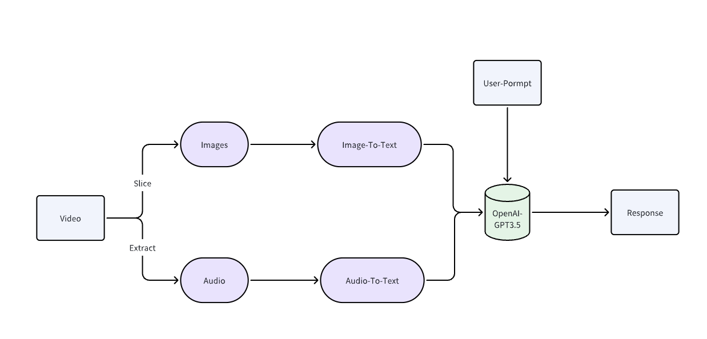

This video_process_bot is a LLM based bot that can understand the user uploaded video and generate corresponding messaged based on the user prompt

# Instructions
for windows system, need to set the config "LongPathsEnabled" to 1 to install transformers
ffmpeg is also a mandatory requirement
pip install transformers

# Required Libraries
machine learning libraries
  pip install torch
  pip install tensorflow

video-to-image
  pip install opencv-python

video to audio
  pip install moviepy
  pip install transformers torchaudio
  pip install whisper

To run the program locally, I used the streamlit library
  pip install streamlit
  npm install -g localtunnel

# How to run
  python -m streamlit run app.py

# How it works?

